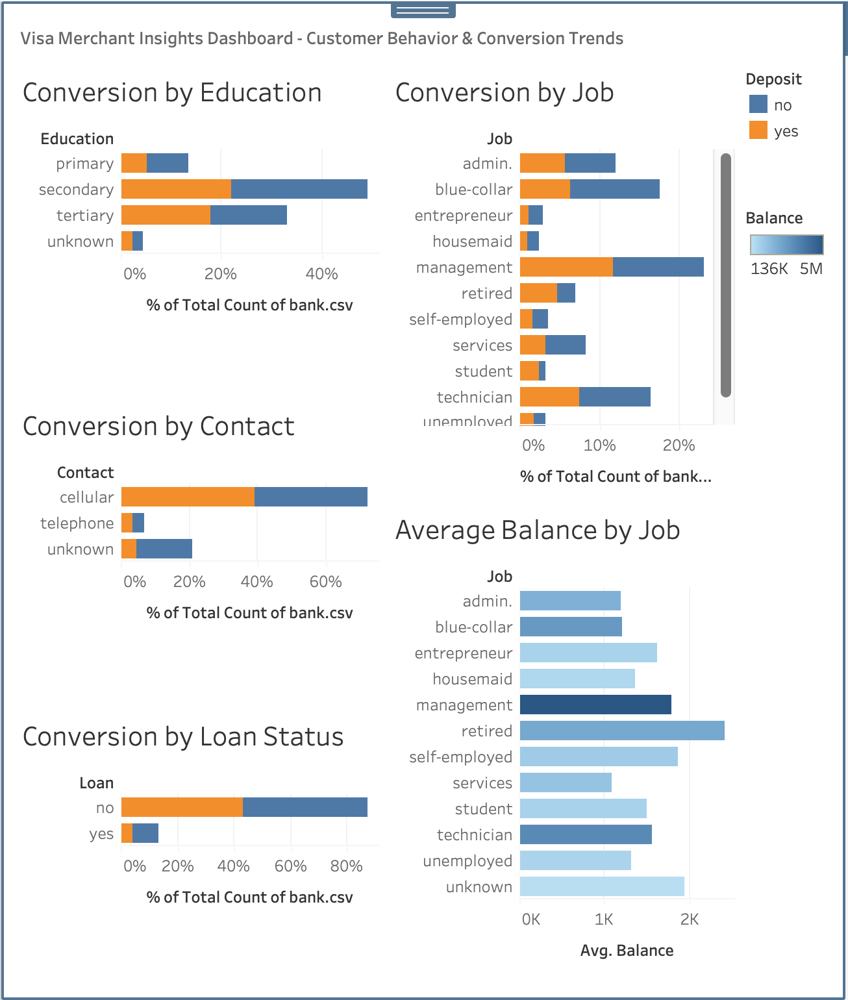

# Visa Merchant Insights Dashboard 🧾

This project simulates how a Visa or fintech analyst would use SQL and Tableau to identify trends in customer behavior, product conversions, and high-value user segments.

---

## 📊 Dashboard Preview

---

## 🔍 Project Goals
- Identify which job types and contact methods have the highest conversion rates
- Explore education and loan status impacts on offer acceptance
- Analyze average account balances by job to find high-value segments

---

## 🛠️ Tools Used
- **SQL (DuckDB)** – for analysis and KPI creation
- **Tableau Public** – for dashboard design
- **VS Code** – to organize SQL files and documentation
- **bank.csv** dataset from Kaggle (Bank Marketing)

---

## 🧠 Key Insights
- **Students and retirees** showed the highest conversion rates
- **Cellular contact** far outperforms telephone and unknown methods
- **Management and retired** customers hold the highest average balances

---

## 📁 Files Included
- `/sql/` – All 5 SQL KPI queries  
- `/images/` – Dashboard screenshot  
- `/Dashboard.twbx` – Tableau workbook file  
- `/data/` – CSV source file

---

## 📌 Business Value
This dashboard mirrors the kind of insights Visa Consulting and Analytics (VCA) might deliver to merchant clients or card issuers: helping them optimize targeting strategies, understand behavior, and increase ROI on outreach.

---

## 🧩 Challenges Faced

- DuckDB initially wasn't installed — solved it via Homebrew terminal install  
- Dataset had to be manually downloaded and prepped due to GitHub preview limitations  
- Figuring out Tableau's Quick Table Calculations and percent conversions took trial + error  
- Learned how to properly structure GitHub projects and push using terminal step-by-step

This project helped solidify SQL KPI logic, data storytelling with Tableau, and repo management — all while simulating a real Visa analyst experience.

# Visa Merchant Insights Dashboard

## 📊 Overview
This project simulates how a Visa analyst would help a banking partner evaluate customer behavior, conversion patterns, and outreach effectiveness using SQL-based KPIs.

## 🚀 Skills Demonstrated
- SQL querying with DuckDB
- Data visualization with Tableau
- Data storytelling and dashboard design
- Git, GitHub, and Markdown formatting

**Dataset:** Bank Marketing Dataset (Kaggle)  
**Tools:** DuckDB, SQL, VS Code  

---

## 🔍 Questions Answered:
1. What job types convert the most?  
2. Which contact method leads to higher product adoption?  

---

## 📁 Files
- `sql/conversion_rate_by_job.sql` → Conversion by job type  
- `sql/conversion_by_contact_method.sql` → Channel performance

---

## 🔧 Tools Used
- **DuckDB**: SQL engine to analyze CSV  
- **VS Code**: Query + file management  
- *(Optional later)* **Tableau Public**: for final dashboard

---

## 🧠 Business Use Case
These insights mimic real Visa engagements:
- Advising banks which segments to target
- Optimizing communication methods (phone vs email)
- Building dashboards that track merchant or customer trends

---

## 💡 Next Steps
- Build a Tableau dashboard for visual KPIs
- Add 2–3 more queries: education, balance, month-over-month
- Push to GitHub with screenshot and finished README

